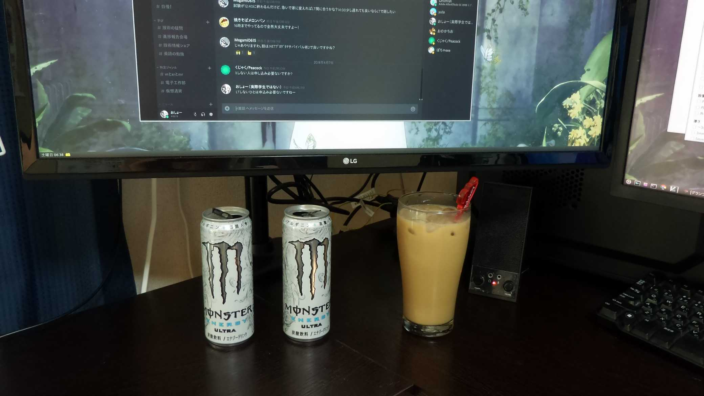

#### 第2回 バーチャル学生エンジニアLT会！！！ in cluster.
- - -
# 開発環境自慢

---

## 開発環境といえば？
- - -

* OS？
* 端末？
* エディタ？

---

## いいえ！
## 今日はハードウェアの話をします！

<del>最近設備投資に10万以上突っ込んだのでその自慢</del>

---

### 自己紹介
- - -

* なまえ  : おしょー（学生ではない）
* Twitter : [@pink_bangbi](https://twitter.com/pink_bangbi)
* github  : [osyo-manga](https://github.com/osyo-manga)
* ブログ  : [Secret Garden(Instrumental)](http://secret-garden.hatenablog.com)
* Ruby    : 本体のパッチ書いたり
* Vim     : 100個以上のプラグインをつくったり
* C++     : 全くわからないけどたのしー

---

#### 開発環境
- - -

---

#### メインマシン(自作)
- - -

* CPU：Core i7 6700K
* メモリ：DDR4 PC4-21300(8GB x 2)
* ストレージ：ウルトラ 3D SSD (250GB)
* グラボ：GV-N105TWF2OC-4GD(GTX 1050 Ti)
* マザボ：Z170 Extreme4
---

#### 机(楽天で売っている L字の机)

---

#### キーボードとマウス

---

#### ヘッドフォン(Mpow MPBH059AB)

---

#### メインディスプレイ(31.5インチ/4K)

---

#### サブディスプレイ(27インチ/4K)

---

#### モニタアーム

---

#### モニタアーム

---

#### 視界

---

#### アームの利点

---

---

#### アームの利点

---

---

#### 椅子(旧)

---

#### 椅子(Steelcase リープチェアV2)

---

#### 改善点
- - -

* ケーブルがやばいことになっているので整理したい
* 机の下が広くなったので何か置きたい
  * パソコン本体を置きたいけどホコリがヤバそう…
* 今年の頭にかった FullHD のディスプレイが余っているので何かに使いたい
* 椅子と机の高さが合わなかった

---

#### まとめ
- - -

* 開発環境は別にソフトウェア面だけではない
* ソフトウェア面と違ってハードウェア面はお金がかかる事が多い
  * あと物理的な場所も必要
* とはいえ、100均とかで売ってるようなものが結構役に経つことが多い
  * ワイヤーラックとかかなりよかった
* フリマサイトなど有効活用すると思ったよりも低価格で買える事がわかった
---

#### ご清聴
#### ありがとうございました

